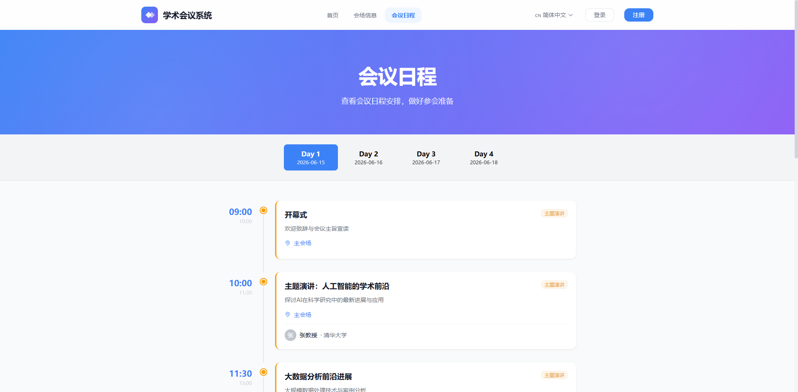
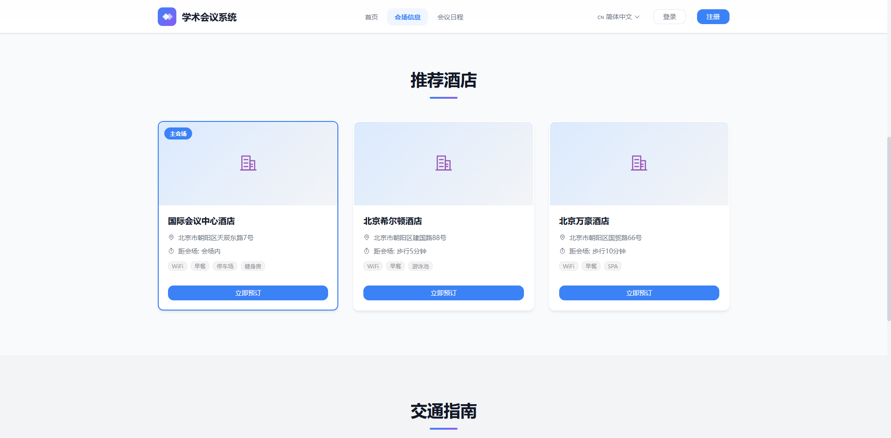
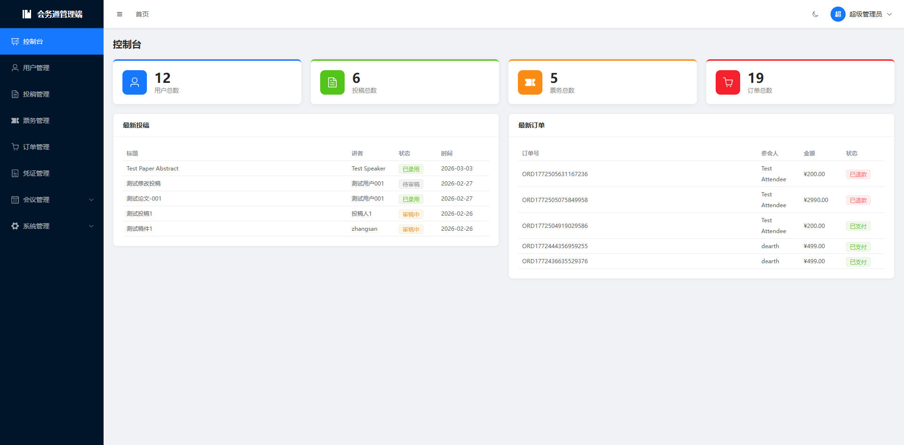

# 会务通 - 学术会议管理平台

<div align="center">


一个功能完善的学术会议管理平台，支持投稿、审稿、注册、票务管理等全流程。

</div>

---

## 📖 项目简介

慧悟通（huiwutong）是一个面向学术会议的全流程管理平台，服务于四类用户角色：

| 角色 | 功能 |
|------|------|
| 🎤 **投稿讲者** | 提交论文、跟踪状态、接收通知 |
| 📝 **审稿人** | 审阅投稿、提供反馈意见 |
| 🎫 **参会者** | 会议注册、购票、获取入场凭证 |
| 👨‍💼 **管理员** | 全流程管理、数据统计 |

## 🖼 项目展示截图

| 首页 | 会议日程 |
|------|----------|
|  |  |

| 会场信息 | 后台管理 |
|----------|----------|
|  |  |

## 🛠 技术栈

### 后端
- **框架**: Java 17 + Spring Boot 3.2.3
- **ORM**: MyBatis Plus 3.5.5
- **数据库**: MySQL 8.0
- **缓存**: Redis
- **认证**: JWT
- **构建**: Maven

### 前端
- **框架**: Vue 3 + TypeScript
- **构建工具**: Vite 5
- **UI 库**: Element Plus
- **状态管理**: Pinia
- **路由**: Vue Router 4
- **HTTP**: Axios

## 📁 项目结构

```text
huiwutong/
├── backend/                    # 后端 Spring Boot 项目
│   ├── src/main/java/
│   │   └── com/huiwutong/conference/
│   │       ├── common/         # 公共模块（注解、异常、工具类）
│   │       ├── config/         # 配置类
│   │       ├── controller/     # 控制器层
│   │       │   ├── admin/      # 管理端接口
│   │       │   └── conference/ # 用户端接口
│   │       ├── entity/         # 实体类
│   │       ├── mapper/         # MyBatis Mapper
│   │       └── service/        # 服务层
│   └── src/main/resources/
│       └── application.yml     # 配置文件
│
├── frontend/
│   ├── admin/                  # 管理端前端 (端口 3001)
│   │   └── src/
│   │       ├── api/            # API 接口
│   │       ├── components/     # 公共组件
│   │       ├── router/         # 路由配置
│   │       ├── stores/         # Pinia 状态
│   │       └── views/          # 页面组件
│   │
│   └── portal/                 # 用户端前端 (端口 5173)
│       └── src/
│           ├── api/
│           ├── components/
│           ├── router/
│           ├── stores/
│           └── views/
│
└── docs/                       # 文档目录
    ├── 开发计划/               # 开发计划与日志
    └── 开发文档/               # 技术文档与 SQL 脚本
```

## 🚀 快速开始

### 环境要求

- JDK 17+
- Node.js 18+
- MySQL 8.0+
- Redis 6.0+
- Maven 3.8+

### 后端启动

```bash
# 1. 进入后端目录
cd backend

# 2. 安装依赖
mvn clean install

# 3. 执行数据库迁移
mysql -u root -p mclc < ../docs/开发文档/sql/migration/01_*.sql
mysql -u root -p mclc < ../docs/开发文档/sql/migration/02_*.sql
# ... 按顺序执行所有迁移脚本

# 4. 启动服务
mvn spring-boot:run
```

后端服务运行在 http://localhost:8080

### 前端启动

```bash
# 管理端
cd frontend/admin
npm install
npm run dev
# 访问 http://localhost:3001

# 用户端
cd frontend/portal
npm install
npm run dev
# 访问 http://localhost:5173
```

## 📡 API 概览

### 用户端接口（部分无需登录）

| 方法 | 路径 | 说明 |
|------|------|------|
| POST | `/api/auth/login` | 用户登录 |
| POST | `/api/auth/register` | 用户注册 |
| GET | `/api/conference/info` | 获取会议信息 |
| GET | `/api/conference/schedule` | 获取日程列表 |
| GET | `/api/conference/experts` | 获取专家列表 |
| GET | `/api/conference/hotels` | 获取酒店列表 |

### 管理端接口（需 admin 角色）

| 方法 | 路径 | 说明 |
|------|------|------|
| POST | `/api/admin/conference` | 创建/更新会议信息 |
| GET | `/api/admin/experts` | 专家列表 |
| POST | `/api/admin/expert` | 创建专家 |
| GET | `/api/admin/schedule` | 日程列表 |
| POST | `/api/admin/hotel` | 创建酒店 |

## 🔐 默认账号

| 角色 | 邮箱 | 密码 |
|------|------|------|
| 管理员 | admin@huiwutong.com | Admin@2026 |

## 📦 模块功能

### 已完成模块

| 模块 | 状态 | 说明 |
|------|------|------|
| ✅ 用户认证 | 完成 | 登录、注册、Token 刷新 |
| ✅ 文件管理 | 完成 | 多 OSS 供应商支持 |
| ✅ 会议配置 | 完成 | 会议信息、日程、专家、酒店 |

### 开发中模块

| 模块 | 状态 | 说明 |
|------|------|------|
| ⏳ 论文投稿 | 计划中 | 投稿、审稿流程 |
| ⏳ 票务管理 | 计划中 | 票种、订单、支付 |
| ⏳ 入场凭证 | 计划中 | 二维码生成、核验 |

## 🔧 开发指南

### 代码规范

- **前端**: ESLint + Prettier，TypeScript 严格模式
- **后端**: Alibaba Java 编码规范
- **提交**: Conventional Commits (feat/fix/docs/style/refactor)

### 分支策略

```text
main        # 生产分支
├── develop # 开发分支
│   ├── feature/xxx  # 功能分支
│   ├── bugfix/xxx   # 修复分支
│   └── refactor/xxx # 重构分支
```

### 常用命令

```bash
# 后端测试
cd backend && mvn test

# 前端类型检查
cd frontend/admin && npm run type-check

# 前端构建
cd frontend/admin && npm run build
```

## 📝 更新日志

### v1.0.0 (2026-03-09)
- ✨ 完成会议配置模块（会议信息、日程、专家、酒店）
- ✨ 完成文件模块（多 OSS 供应商支持）
- ✨ 完成用户认证模块

## 📄 许可证

[MIT License](LICENSE)

---

<div align="center">

**慧悟通** © 2026 - Present

</div>
